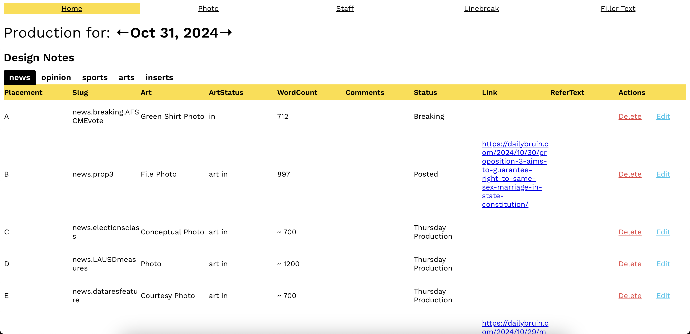
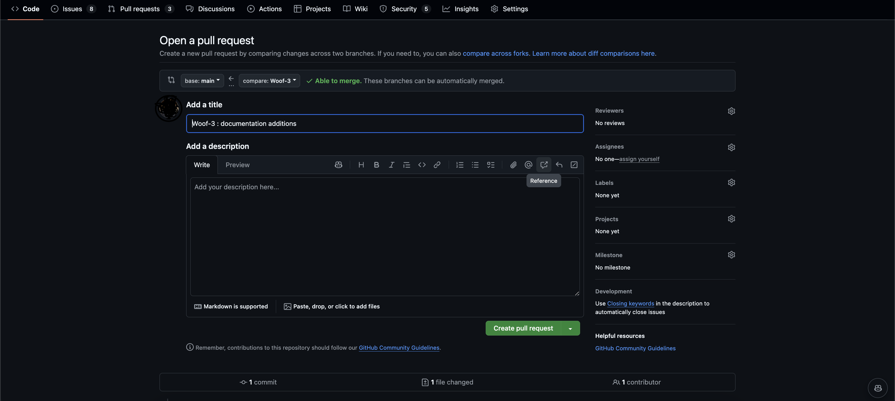

# Buzz! 🐝🍯
Buzz is where we document design notes each time we print the newspaper. Typically, it is filled out a couple of hours before the paper is designed, a day before it is put on stands. These notes include what art or articles will be used and how the newspaper should be laid out. The Content section fills this out, while Design Editors use it to design and lay out the paper.



There will be a new Figma and Design doc coming soon!

## Technology Stack

**Frontend:**


**Backend:**
 
 


## Getting Setup

1. Fill in the `.env` file
```
CLIENT_SECRET=
SESSION_SECRET=    
MONGO_URL=
NODE_ENV= 
ADMINS=
BOT_TOKEN=
CLIENT_TOKEN=
CLIENT_ID=
```

2. To build the images, run 
```
docker-compose build
```

3. To run the containers, run 
```
docker-compose up
```
*The docker containers are already volume mounted and so your developed local changes are already reflected in the localhost once you save them.

4. Visit [http://localhost:3000/](http://localhost:3000/)


## How do I contribute?
If you'd like to contribute:
1. Create a branch, to standardize branch naming conventions; branches are usually named after the ticket number assigned to it.
```
git checkout -b <Ticket_Number>
```
2. Develop on the branch, stage, commit, and push the code to the branch
```
git add .
git commit -m "<Ticket_Number> : <commit message">
git push
```
*The first push will require a push upstream 
```git push --set-upstream origin <branch_name>```


3. Make a Pull Request (PR) on GitHub, usually you will need to visit the exact branch in GitHub and then creating a PR. 

Hit Create Pull Request. Then await for approval from an administrator.

4. Once approved, your changes will be merged and you've made a contribution into production!

## File Structure
```
BUZZ/
├── controllers/
├── db/
│   └── models/
│       ├── DesignNote.js
│       ├── InstagramStory.js
│       ├── Member.js
│       ├── Modular.js
│       ├── Schedule.js
│       ├── User.js
│       └── index.js
├── login/
├── node_modules/
├── public/
├── routes/
│   └── api/
│       ├── designNotes.js
│       ├── index.js
│       ├── member.js
│       ├── modulars.js
│       ├── schedule.js
│       ├── story.js
│       ├── utils.js
│       ├── auth.js
│       ├── index.js
│       └── session.js
├── src/
│   ├── components/
│   │   ├── Filler/
│   │   ├── H/
│   │   ├── Linebreak/
│   │   ├── PhotoInitials/
│   │   ├── Shared/
│   │   └── Staff/
│   ├── services/
│   ├── App.js
│   ├── App.test.js
│   ├── config.js
│   ├── history.js
│   ├── index.css
│   ├── index.js
│   └── serviceWorker.js
├── .babelrc
├── .dockerignore
├── .env
├── .env.example
├── .gitignore
├── docker-compose.yml
├── Dockerfile
├── index.js
├── package-lock.json
└── package.json
```

## Deployment

1. `webpack -p`

2. `docker-compose build`

3. `docker-compose up`

4. `docker tag`

5. `docker push`
